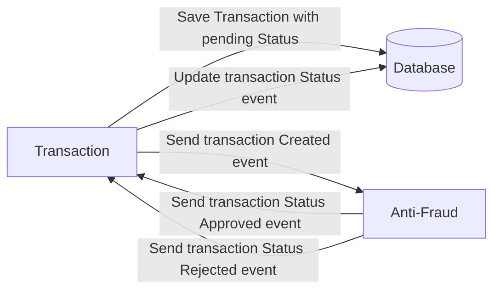

# Yape Code Challenge :rocket:

Our code challenge will let you marvel us with your Jedi coding skills :smile:. 

Don't forget that the proper way to submit your work is to fork the repo and create a PR :wink: ... have fun !!

- [Problem](#problem)
- [Tech Stack](#tech_stack)
- [Send us your challenge](#send_us_your_challenge)

# Problem

Every time a financial transaction is created it must be validated by our anti-fraud microservice and then the same service sends a message back to update the transaction status.
For now, we have only three transaction statuses:

<ol>
  <li>pending</li>
  <li>approved</li>
  <li>rejected</li>  
</ol>

Every transaction with a value greater than 1000 should be rejected.



# Tech Stack

<ol>
  <li>Node (Nestjs and Prisma) </li>
  <li>Postgres</li>
  <li>Kafka</li>    
</ol>

We do provide a `Dockerfile` to help you get started with a dev environment.

You must have two resources:

1. Resource to create a transaction that must containt:

```json
{
  "accountExternalIdDebit": "Guid",
  "accountExternalIdCredit": "Guid",
  "tranferTypeId": 1,
  "value": 120
}
```

2. Resource to retrieve a transaction

```json
{
  "transactionExternalId": "Guid",
  "transactionType": {
    "name": ""
  },
  "transactionStatus": {
    "name": ""
  },
  "value": 120,
  "createdAt": "Date"
}
```
## Setup
### In the `root` folder

1. Run docker compose
```sh
docker compose up
```

### In the `transaction` folder

1. Install packages
```sh
npm i
```

2. Copy the `.env.example` file to `.env` in the same folder
```sh
cp .env.example .env
```

3. Execute the creation of the Prisma schema with
```sh
npm run db:sync
```
This will create the schema in both shards.

4. Build the application
```sh
npm run build
```

5. Run the application
```sh
npm run start
```

### In the `antifraud` folder

1. Install packages
```sh
npm i
```

2. Copy the `.env.example` file to `.env` in the same folder
```sh
cp .env.example .env
```

3. Build the application
```sh
npm run build
```

4. Run the application
```sh
npm run start
```

## Optional

You can use any approach to store transaction data but you should consider that we may deal with high volume scenarios where we have a huge amount of writes and reads for the same data at the same time. How would you tackle this requirement?

To address this scenario, two proposals were made:
- The first one involves using cache for the endpoint to retrieve transactions by ID.
- The second proposal suggests utilizing sharding with the 'TransferTypeId' attribute to distribute the load.
